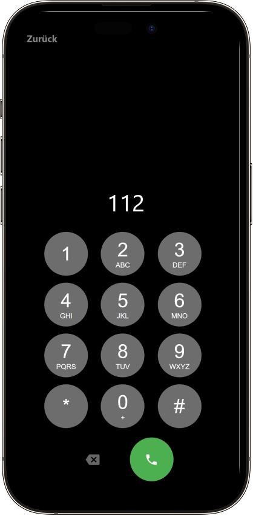
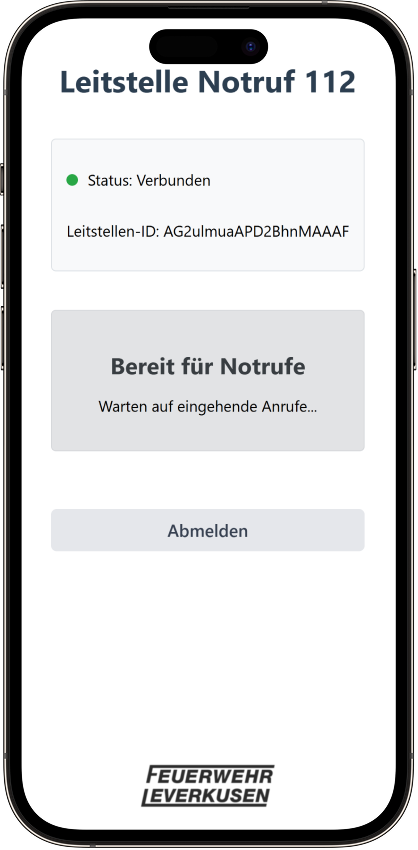
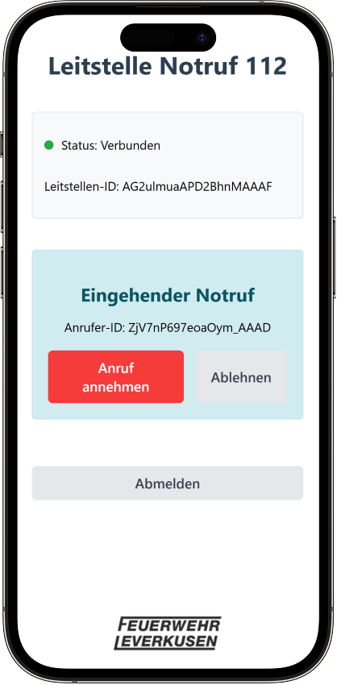
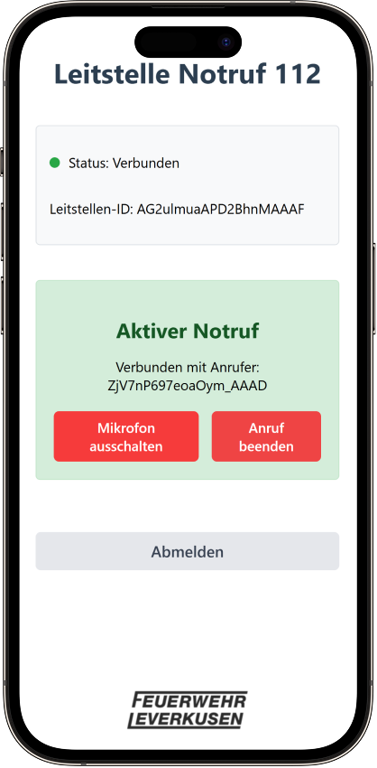

# 🧒📞 112-Training für Kinder – Interaktiver Notruf-Simulator im Browser

Ein innovatives, webbasiertes Lernwerkzeug, das Kindern auf spielerische und praxisnahe Weise vermittelt, wie ein Notruf korrekt abgesetzt wird. Der Simulator ersetzt klassische physische Hilfsmittel wie den Telefonkoffer durch eine moderne, digitale Lösung – realitätsnah, flexibel und sofort einsatzbereit im Browser.

Ideal geeignet für den Einsatz im Rahmen von Brandschutzerziehung, Erste-Hilfe-Schulungen oder allgemeinen Sicherheitstrainings in Schulen, Kitas oder bei öffentlichen Präventionsveranstaltungen.

## 🚀 Features

- **Smartphone-ähnliches Tastenfeld:** Intuitive Benutzeroberfläche zum Wählen der Notrufnummer – vollständig im Browser ohne Zusatzhardware.  
- **Virtuelle Notruf-Simulation:** Eine erwachsene Person übernimmt die Rolle der Leitstelle und kommuniziert mit den Kindern über eine integrierte Audioverbindung.  
- **Mehrere Kinder und Betreuende gleichzeitig:** Die Anwendung unterstützt simultane Trainingseinheiten – ideal für Gruppenübungen in Schulen, Kitas oder Erste-Hilfe-Kursen.  
- **Realitätsnahe Übungsszenarien:** Der Ablauf eines echten Notrufs wird nachgestellt – von der Wahl der Notrufnummer bis zur Beantwortung wichtiger W-Fragen.  
- **Plattformunabhängig:** Kompatibel mit allen gängigen Geräten (Smartphones, Tablets, Laptops) – ganz ohne SIM-Karte, Telefonnetz oder spezielle Apps.  

## 📱Vorschau

    
    

    
    
    

